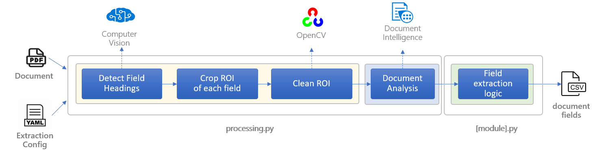

# Doc Intelligence for Insurance Forms

### Architecture



### Scripts

- process.py: extracts claim form fields values.

### Pre-reqs

- Poppler: ```Conda install -c conda-forge poppler```

### How to run?

- Create .env file based on .env.template

- run the script:

```python process.py -i [FORMS_FOLDER_OR_SINGLE_PDF_PATH] -c [FORM_PROCESSING_CONFIG_FILE]```

Example: 

```python process.py -i data/xyz.pdf -c 1500.config.yaml```

#### Custom Vision Model

The script will use an Azure Computer Vision custom model to detect objects and crop specific regions for each field before sending to Document Intelligence. Cropping will be based on the configuration defined in the specific form yaml file. 

[1500 claim form](./1500.config.yaml), for example, configures 1500 forms extraction and requires a custom object detection model trained to detect **charges**, **totacharges**, **datesofservice**, **qty** and **birthdate** labels.